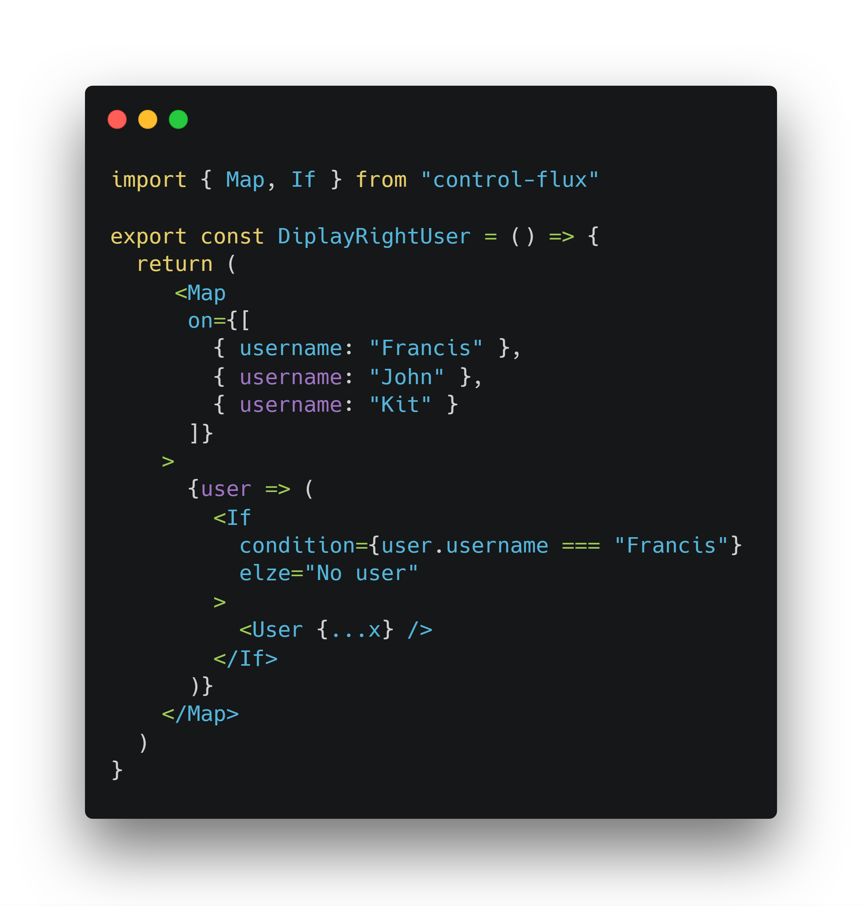
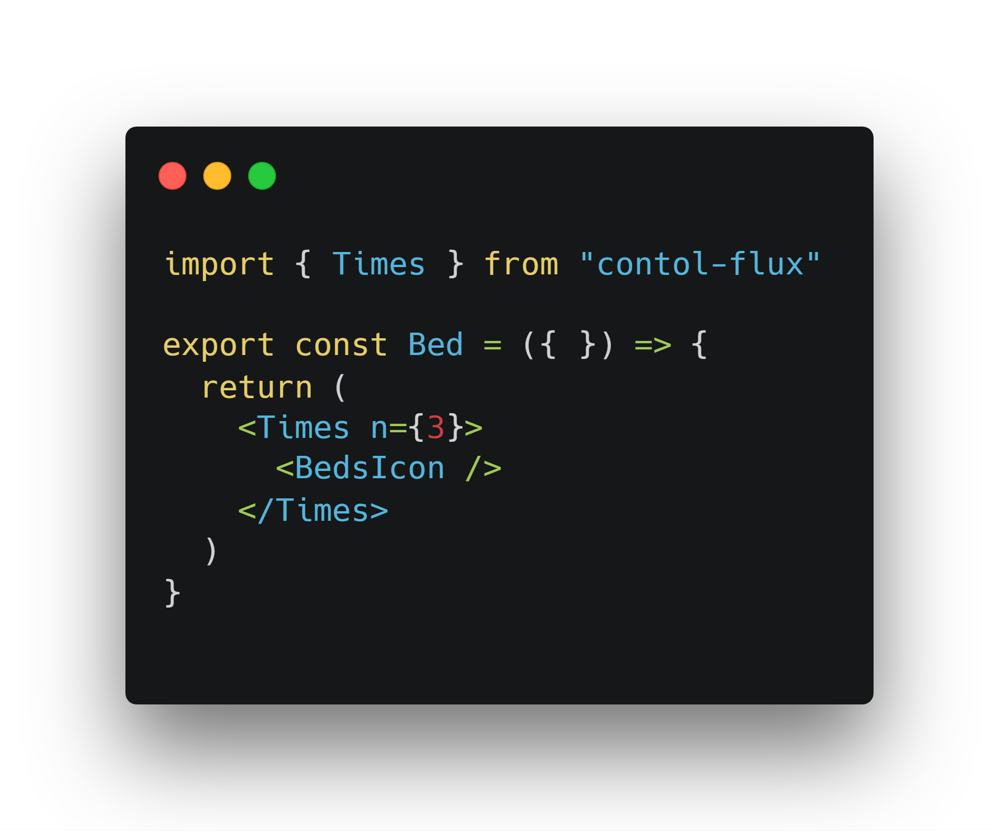
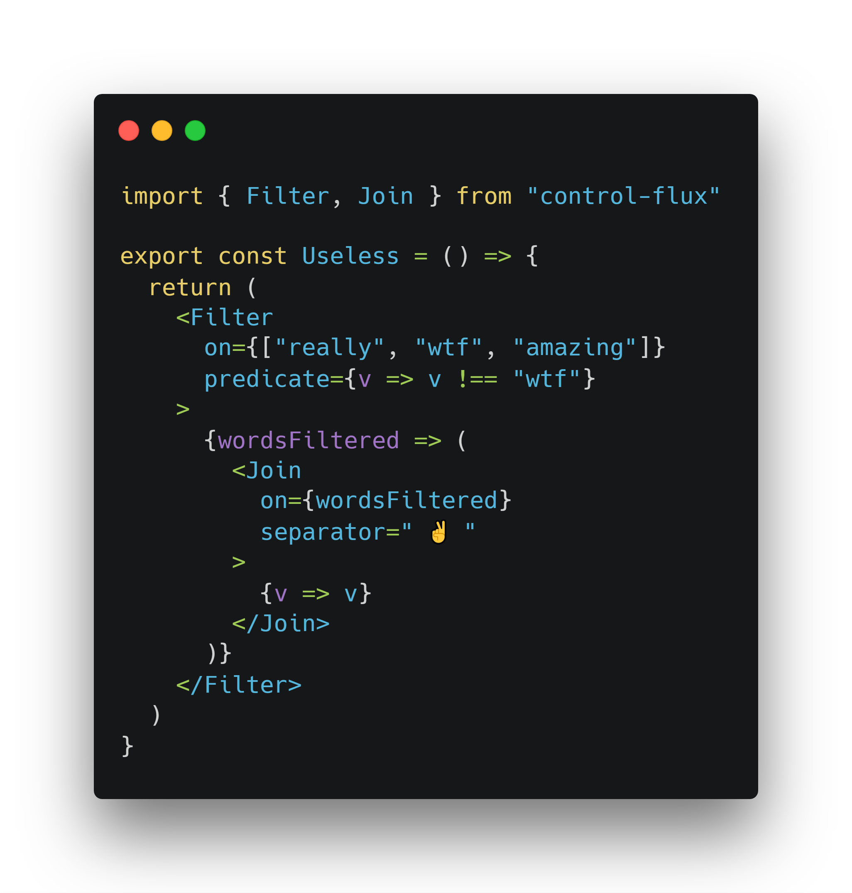

# control-flux

[![Travis][build-badge]][build]
[![npm package][npm-badge]][npm]
[![Coveralls][coveralls-badge]][coveralls]

🎈 `control-flux` provide components that mimic some methods of javascript, for a pure `declarative` approach, or something like that.

## Installation

Use the package manager [pip](https://pip.pypa.io/en/stable/) to install foobar.

```bash
pip install foobar
```

## 👓 Some example

You can map users and display only the right user by username
<div align="center">
  
</div>

or display n times a component
<div align="center">
  
</div>

or filter and join something like
<div align="center">
  
</div>

## API
<details>
<summary>Array.prototype</summary>

- Every
- Filter
- Map
- Some
- Includes
- Sort
- Fill
- Find
- FindIndex
- Join
- Reverse

</details>

<details>
<summary>Extra</summary>

- If
- First
- Last
- Times
</details>

## 🚶 Developed By

```
Francesco Megna
```
- [LinkedIn](https://www.linkedin.com/in/francesco-megna-19a266162)

# 👍 How to Contribute
1. Fork it
2. Create your feature branch (git checkout -b my-new-feature)
3. Commit your changes (git commit -am 'Add some feature')
4. Push to the branch (git push origin my-new-feature)
5. Create new Pull Request

# 👷 Roadmap
* Normalize api based on [MDN doc](https://developer.mozilla.org/en-US/docs/Web/JavaScript/Reference/Global_Objects/Array)
* Expand the components taking inspiration from other javascript prototypes.

# 📃 License

    MIT License
    
    Copyright (c) 2019 Francesco Megna
    
    Permission is hereby granted, free of charge, to any person obtaining a copy
    of this software and associated documentation files (the "Software"), to deal
    in the Software without restriction, including without limitation the rights
    to use, copy, modify, merge, publish, distribute, sublicense, and/or sell
    copies of the Software, and to permit persons to whom the Software is
    furnished to do so, subject to the following conditions:
    
    The above copyright notice and this permission notice shall be included in all
    copies or substantial portions of the Software.
    
    THE SOFTWARE IS PROVIDED "AS IS", WITHOUT WARRANTY OF ANY KIND, EXPRESS OR
    IMPLIED, INCLUDING BUT NOT LIMITED TO THE WARRANTIES OF MERCHANTABILITY,
    FITNESS FOR A PARTICULAR PURPOSE AND NONINFRINGEMENT. IN NO EVENT SHALL THE
    AUTHORS OR COPYRIGHT HOLDERS BE LIABLE FOR ANY CLAIM, DAMAGES OR OTHER
    LIABILITY, WHETHER IN AN ACTION OF CONTRACT, TORT OR OTHERWISE, ARISING FROM,
    OUT OF OR IN CONNECTION WITH THE SOFTWARE OR THE USE OR OTHER DEALINGS IN THE
    SOFTWARE.


[build-badge]: https://img.shields.io/travis/user/repo/master.png?style=flat-square
[build]: https://travis-ci.org/user/repo

[npm-badge]: https://img.shields.io/npm/v/npm-package.png?style=flat-square
[npm]: https://www.npmjs.org/package/npm-package

[coveralls-badge]: https://img.shields.io/coveralls/user/repo/master.png?style=flat-square
[coveralls]: https://coveralls.io/github/user/repo
